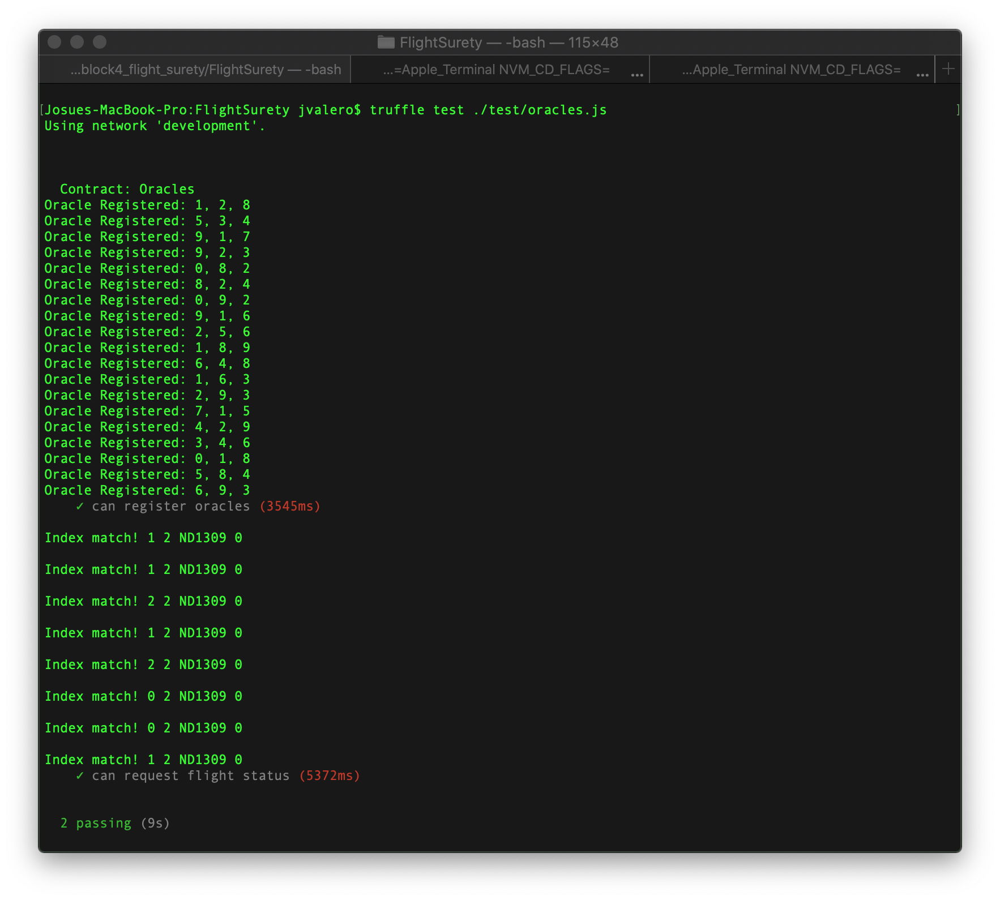
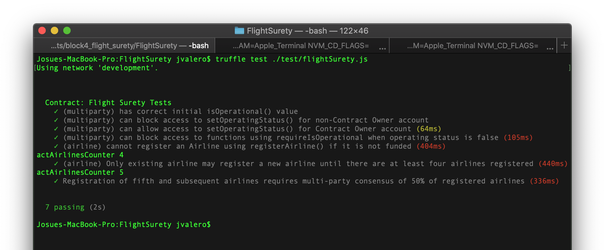
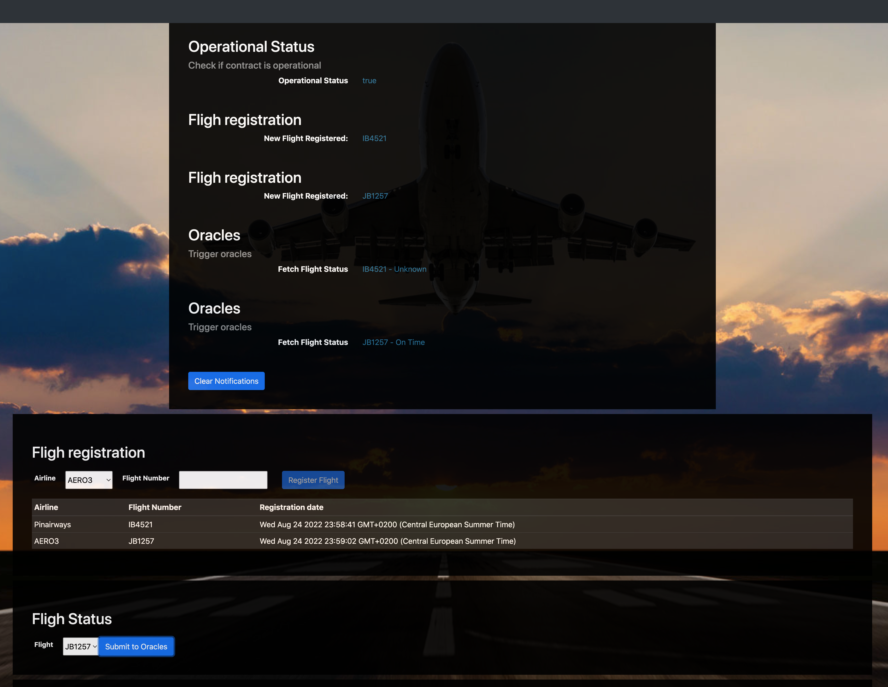
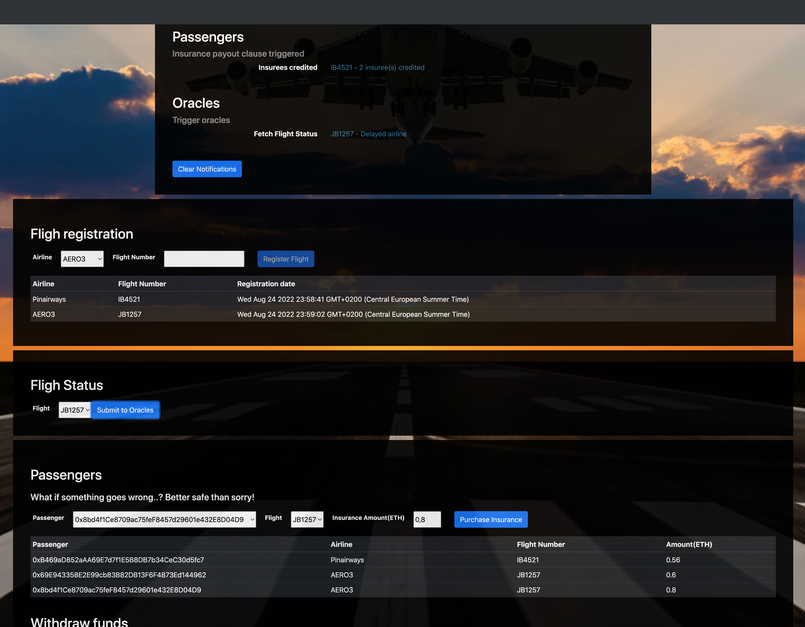
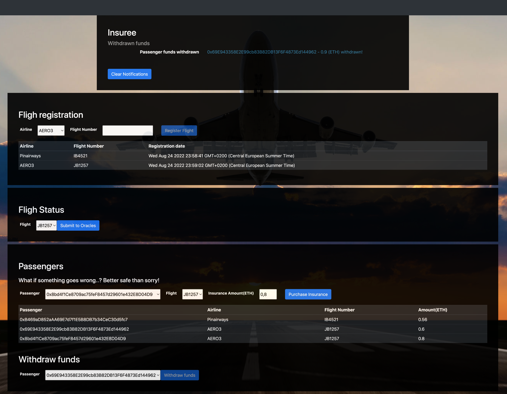

# FlightSurety

FlightSurety is a sample application project for Udacity's Blockchain course.

## Install

This repository contains Smart Contract code in Solidity (using Truffle), tests (also using Truffle), dApp scaffolding (using HTML, CSS and JS) and server app scaffolding.

To install, download or clone the repo, then:

`npm install`
`truffle compile`

To start using the dapp / execute the tests please run ganache with: 100 accounts and 500 Ether by account.

## Develop Client

To run truffle tests:

`truffle test ./test/oracles.js`
`truffle test ./test/flightSurety.js`

* Before proceeding to run the dapp an the server, please remember to run `truffle migrate --reset` and startup ganache

## Develop Server

`npm run server`

It interacts with the Smart contracts via FlightSuretyApp contract. It takes care of the oracle registration (By default 30 are registered) and listen to events generated when a user requests status information for a flight.
Then it responds with a random generated status code for the requested flight.

## DAPP

When the dapp is started up it generates:

- 4 active airlines (The initial one when the smart contract is instantiated and 3 more    corresponding to the next 3 accounts from your ganache)

- 5 passengers corresponding to the next 5 accounts of your ganache.

The dapp has areas:

- On top it has a notification panel where most of the notifications of the dapp are displayed. It has a button to clear the existing notifications for convenience.

- Below, a panel destined for airlines where they can register Flights.

- Next is a panel where the user can request Information about flights already registered. The status information is displayed on the notification panel.

- Finally an area where the passengers can purchase insurance policies for the registered flights and below it a section to withdraw the payouts that have been credited to them when the flight for which they purchased an insurance was delayed due to the airline's fault. (The withdraw funds button will become available only when the selected passengers have funds pending to be withdrawn after a policy payout)

To use the dapp:

`npm run dapp`

To view dapp:

`http://localhost:8000`

## Deploy

To build dapp for prod:
`npm run dapp:prod`

Deploy the contents of the ./dapp folder

## Resources

* [How does Ethereum work anyway?](https://medium.com/@preethikasireddy/how-does-ethereum-work-anyway-22d1df506369)
* [BIP39 Mnemonic Generator](https://iancoleman.io/bip39/)
* [Truffle Framework](http://truffleframework.com/)
* [Ganache Local Blockchain](http://truffleframework.com/ganache/)
* [Remix Solidity IDE](https://remix.ethereum.org/)
* [Solidity Language Reference](http://solidity.readthedocs.io/en/v0.4.24/)
* [Ethereum Blockchain Explorer](https://etherscan.io/)
* [Web3Js Reference](https://github.com/ethereum/wiki/wiki/JavaScript-API)
